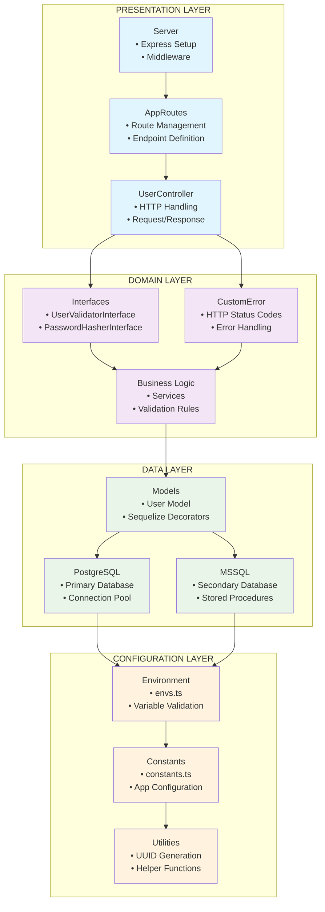
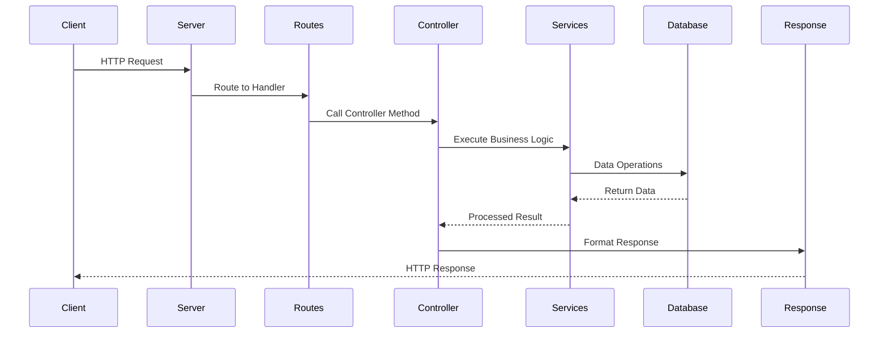

# Análisis Arquitectónico del Proyecto

## 📋 Resumen Ejecutivo

Este proyecto implementa una **API REST** desarrollada en **Node.js con TypeScript**, siguiendo una **arquitectura en capas (Layered Architecture)** con principios **SOLID**. La aplicación maneja usuarios con autenticación segura usando bcrypt y soporta múltiples bases de datos (PostgreSQL y MSSQL).

## 🛠️ Tecnologías Utilizadas

### **Lenguajes y Runtime**

- **Node.js** - Runtime de JavaScript
- **TypeScript 5.9.2** - Superset tipado de JavaScript
- **CommonJS** - Sistema de módulos

### **Framework Web**

- **Express 5.1.0** - Framework web minimalista para Node.js
- **@types/express 5.0.3** - Definiciones de tipos para Express

### **Bases de Datos**

- **PostgreSQL** - Base de datos principal
  - **pg 8.16.3** - Cliente PostgreSQL para Node.js
  - **pg-hstore 2.3.4** - Serializador para PostgreSQL
- **MSSQL** - Base de datos secundaria
  - **mssql 11.0.1** - Cliente SQL Server para Node.js
  - **@types/mssql 9.1.8** - Definiciones de tipos para MSSQL

### **ORM y Modelado**

- **Sequelize 6.37.7** - ORM para Node.js
- **sequelize-typescript 2.1.6** - Decoradores TypeScript para Sequelize

### **Seguridad**

- **bcrypt** - Hashing de contraseñas (instalado recientemente)
- **@types/bcrypt** - Definiciones de tipos para bcrypt

### **Configuración y Utilidades**

- **dotenv 17.2.2** - Carga variables de entorno
- **env-var 7.5.0** - Validación de variables de entorno
- **uuid 13.0.0** - Generación de identificadores únicos

### **Herramientas de Desarrollo**

- **ts-node-dev 2.0.0** - Servidor de desarrollo con hot reload
- **rimraf 6.0.1** - Limpieza de archivos multiplataforma
- **@types/node 24.5.2** - Definiciones de tipos para Node.js

## 🏗️ Estructura de la Arquitectura

### **Patrón Arquitectónico: Layered Architecture**



### **Diagrama de Flujo de Datos**



## 📁 Estructura Detallada de Carpetas y Archivos

```
capacitacion/
├── 📄 package.json                    # Dependencias y scripts
├── 📄 tsconfig.json                   # Configuración TypeScript
├── 📄 docker-compose.yaml             # Configuración Docker
├── 📄 AGENTS.md                       # Guías de desarrollo
├── 📄 ARCHITECTURE.md                 # Este documento
├── 📁 .cursor/                        # Configuración Cursor IDE
│   └── 📁 rules/                      # Reglas de desarrollo
│       ├── 📄 layered-architecture.mdc
│       ├── 📄 solid-principles.mdc
│       ├── 📄 typescript-standards.mdc
│       └── 📄 ...
└── 📁 src/                            # Código fuente principal
    ├── 📄 app.ts                      # Punto de entrada de la aplicación
    ├── 📁 config/                     # Capa de Configuración
    │   ├── 📄 constants.ts            # Constantes de la aplicación
    │   ├── 📄 envs.ts                 # Variables de entorno
    │   └── 📄 generate-uuid.ts        # Utilidades para UUID
    ├── 📁 data/                       # Capa de Datos
    │   ├── 📄 index.ts                # Exportaciones de datos
    │   ├── 📁 postgres/               # Implementación PostgreSQL
    │   │   ├── 📄 postgres-database.ts # Conexión PostgreSQL
    │   │   └── 📁 models/             # Modelos de datos
    │   │       └── 📄 user.model.ts   # Modelo de Usuario
    │   └── 📁 mssql/                  # Implementación MSSQL
    │       └── 📄 mssql-database.ts   # Conexión MSSQL
    ├── 📁 domain/                     # Capa de Dominio
    │   ├── 📁 errors/                 # Manejo de errores
    │   │   └── 📄 custom.error.ts     # Clases de error personalizadas
    │   └── 📁 interfaces/             # Contratos e interfaces
    │       ├── 📄 password-hasher.interface.ts
    │       └── 📄 user-validator.interface.ts
    └── 📁 presentation/               # Capa de Presentación
        ├── 📁 common/                 # Utilidades compartidas
        │   └── 📄 handleError.ts      # Manejo centralizado de errores
        ├── 📄 routes.ts               # Rutas principales
        ├── 📄 server.ts               # Configuración del servidor
        ├── 📁 tasks/                  # Módulo de tareas (vacío)
        └── 📁 users/                  # Módulo de usuarios
            ├── 📄 controller.ts       # Controlador de usuarios
            ├── 📄 routes.ts           # Rutas de usuarios
            └── 📁 services/           # Servicios de negocio
                ├── 📄 creator-user.service.ts      # Creación de usuarios
                ├── 📄 finder-all-user.service.ts   # Búsqueda de usuarios
                ├── 📄 password-hasher.service.ts   # Hashing de contraseñas
                ├── 📄 user-validator.service.ts    # Validación de usuarios
                ├── 📄 examplePa1.service.ts        # Servicio de ejemplo 1
                └── 📄 examplePa2.service.ts        # Servicio de ejemplo 2
```

## 🔄 Flujo de Datos y Dependencias

### **Flujo de una Petición HTTP**

1. **Entrada**: Cliente envía petición HTTP
2. **Server**: Express recibe la petición
3. **Routes**: AppRoutes → UserRoutes
4. **Controller**: UserController maneja la petición
5. **Services**: Servicios de negocio procesan la lógica
6. **Domain**: Interfaces y validaciones
7. **Data**: Acceso a base de datos (PostgreSQL/MSSQL)
8. **Response**: Respuesta HTTP estructurada

### **Dependencias entre Capas**

```
Presentation Layer
    ↓ (depende de)
Domain Layer
    ↑ (implementado por)
Data Layer
    ↓ (usa)
Configuration Layer
```

## 🎯 Principios SOLID Implementados

### **1. Single Responsibility Principle (SRP)**

- **Controllers**: Solo manejo HTTP
- **Services**: Solo lógica de negocio
- **Models**: Solo representación de datos
- **Validators**: Solo validación
- **Password Hashers**: Solo hashing

### **2. Open/Closed Principle (OCP)**

- Servicios extensibles mediante interfaces
- Nuevas implementaciones sin modificar código existente
- Manejo de errores extensible

### **3. Liskov Substitution Principle (LSP)**

- Servicios intercambiables que implementan la misma interfaz
- Implementaciones de base de datos sustituibles

### **4. Interface Segregation Principle (ISP)**

- Interfaces específicas y enfocadas
- Evita interfaces "gordas" con métodos no utilizados

### **5. Dependency Inversion Principle (DIP)**

- Dependencia de abstracciones, no implementaciones concretas
- Inyección de dependencias por constructor

## 🔐 Características de Seguridad

- **Hashing de Contraseñas**: bcrypt con 12 salt rounds
- **Validación de Entrada**: Validación exhaustiva de datos
- **Manejo de Errores**: No exposición de información sensible
- **Tipado Fuerte**: TypeScript para prevenir errores de tipo
- **Sanitización**: Limpieza de datos de entrada

## 📊 Métricas del Proyecto

- **Total de Archivos TypeScript**: 15
- **Capas Arquitectónicas**: 4
- **Servicios de Negocio**: 6
- **Interfaces de Dominio**: 2
- **Modelos de Datos**: 1
- **Bases de Datos Soportadas**: 2 (PostgreSQL, MSSQL)

## 🚀 Endpoints Disponibles

- **POST** `/api/users/register` - Registro de usuarios
- **GET** `/api/users/` - Listar todos los usuarios
- **GET** `/api/users/example-pa-1` - Servicio de ejemplo 1
- **GET** `/api/users/example-pa-2` - Servicio de ejemplo 2

## 🔧 Scripts de Desarrollo

- **`npm run dev`** - Servidor de desarrollo con hot reload
- **`npm run build`** - Compilación TypeScript
- **`npm start`** - Ejecución en producción

## 📈 Ventajas de la Arquitectura

1. **Mantenibilidad**: Separación clara de responsabilidades
2. **Escalabilidad**: Fácil adición de nuevas funcionalidades
3. **Testabilidad**: Componentes aislados y mockeables
4. **Flexibilidad**: Soporte para múltiples bases de datos
5. **Seguridad**: Implementación robusta de seguridad
6. **Tipado**: TypeScript para mayor confiabilidad

## 🎯 Conclusión

Este proyecto demuestra una implementación sólida de arquitectura en capas con principios SOLID, proporcionando una base robusta y escalable para el desarrollo de APIs REST con Node.js y TypeScript. La separación clara de responsabilidades, el tipado fuerte y las prácticas de seguridad implementadas hacen de este proyecto un excelente ejemplo de desarrollo de software de calidad empresarial.
